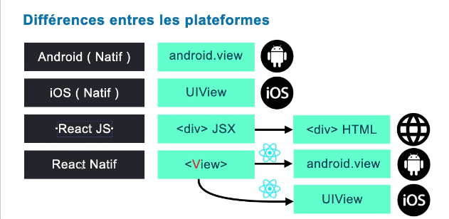

# cour 02 :

## 1. **Développement Natif:**

> Le développement d'applications mobiles peut se faire de différentes manières, parmi lesquelles les approches **native** et **cross-platform**. Voici les principales différences entre ces deux méthodes, en prenant React Native comme exemple de technologie cross-platform :

1. **Langages de Programmation :**

    - **iOS** : Utilise Swift ou Objective-C.
    - **Android** : Utilise Java ou Kotlin.

2. **Performances :**

    - Les applications natives offrent généralement de meilleures performances car elles sont optimisées pour la plateforme spécifique.
    - Accès direct aux API et aux fonctionnalités de l'appareil.

3. **Expérience Utilisateur :**

    - Meilleure intégration avec le système d'exploitation natif, offrant une expérience utilisateur plus fluide et plus réactive.
    - Accès à toutes les fonctionnalités et composants natifs.

4. **Temps et Coût de Développement :**

    - Plus long et plus coûteux car il faut développer et maintenir deux codes distincts pour iOS et Android.

5. **Maintenance et Mises à Jour :**
    - Mise à jour plus complexe car chaque modification doit être faite séparément pour chaque plateforme.

## 2. **Développement Cross-Platform (Exemple : React Native)**

1. **Langage de Programmation :**

    - Utilise JavaScript avec le framework React.
    - Code partagé entre iOS et Android, avec quelques parties spécifiques à chaque plateforme.

2. **Performances :**

    - Légèrement inférieures aux applications natives, bien que React Native soit assez performant pour de nombreuses applications.
    - Utilise une couche d'abstraction pour accéder aux API natives, ce qui peut ajouter un peu de latence.

3. **Expérience Utilisateur :**

    - Peut ne pas offrir une intégration aussi profonde que les applications natives, mais permet de créer une interface utilisateur cohérente sur les deux plateformes.
    - Utilisation de composants natifs pour garantir une apparence et un comportement conformes aux standards de chaque plateforme.

4. **Temps et Coût de Développement :**

    - Plus rapide et moins coûteux car une grande partie du code est réutilisable entre les deux plateformes.
    - Moins de développeurs nécessaires par rapport au développement natif.

5. **Maintenance et Mises à Jour :**
    - Plus facile car le codebase est unifié pour les deux plateformes, ce qui simplifie les mises à jour et la maintenance.

## 3. **comment React native fonctionne :**

-   **Desceiption:**

    > React Native fonctionne en utilisant une approche de pont (bridge) qui permet aux composants écrits en JavaScript de communiquer avec les API natives des plateformes iOS et Android. Voici comment cela fonctionne en prenant l'exemple du composant `View` :

-   **Principe de Fonctionnement de React Native:**

    1. **Code en JavaScript :**

        - Vous écrivez votre application en JavaScript en utilisant des composants React Native comme `View`, `Text`, `Button`, etc.
        - Par exemple, `<View>` est un composant de base pour construire l'interface utilisateur.

    2. **Bridge (Pont) :**

        - React Native utilise un pont pour envoyer des commandes de JavaScript aux modules natifs.
        - Le code JavaScript est exécuté dans un thread séparé et communique avec le code natif via ce pont.

    3. **Rendu Natif :**

        - Pour iOS, `<View>` est mappé sur `UIView`.
        - Pour Android, `<View>` est mappé sur `android.view.View`.

    4. **Communication :**
        - Lorsque le composant `View` est rendu en JavaScript, React Native envoie une commande via le pont pour créer une vue native correspondante sur la plateforme cible.
        - Cela signifie que le rendu final utilise des composants natifs, assurant ainsi une meilleure performance et une apparence native.

