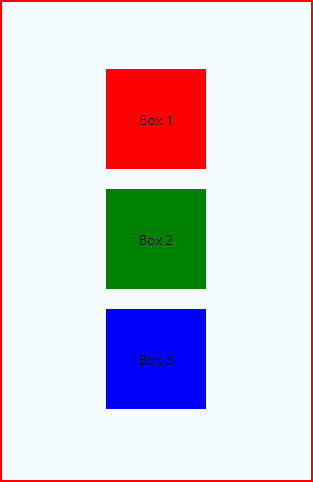
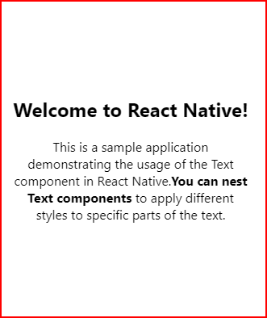

# cour 03 : **`View` et `Text`**

## 1. **`View`:**

-   **Description:**

    > La composante `View` en React Native est l'un des éléments de base utilisés pour construire des interfaces utilisateur. Elle fonctionne de manière similaire à une `div` en HTML, en tant que conteneur flexible qui peut inclure d'autres composants et éléments.

    -   **Flexbox**: `View` utilise le système de mise en page Flexbox par défaut, ce qui permet une disposition flexible et réactive des enfants.
    -   **Styling**: Vous pouvez appliquer des styles en utilisant l'objet `style`, similaire à la manière dont les styles CSS sont appliqués sur le web.

-   **Syntaxe:**

    ```jsx
    import { View, Text, StyleSheet } from "react-native";

    const App = () => {
        return (
            <View style={styles.container}>
                <Text>Hello, World!</Text>
            </View>
        );
    };
    ```

-   **Exemple complet:**

    ```jsx
    import React from "react";
    import { View, Text, StyleSheet } from "react-native";

    const App = () => {
        return (
            <View style={styles.container}>
                <View style={styles.box1}>
                    <Text>Box 1</Text>
                </View>
                <View style={styles.box2}>
                    <Text>Box 2</Text>
                </View>
                <View style={styles.box3}>
                    <Text>Box 3</Text>
                </View>
            </View>
        );
    };

    const styles = StyleSheet.create({
        container: {
            flex: 1,
            justifyContent: "center",
            alignItems: "center",
            backgroundColor: "#F5FCFF",
        },
        box1: {
            width: 100,
            height: 100,
            backgroundColor: "red",
            justifyContent: "center",
            alignItems: "center",
            margin: 10,
        },
        box2: {
            width: 100,
            height: 100,
            backgroundColor: "green",
            justifyContent: "center",
            alignItems: "center",
            margin: 10,
        },
        box3: {
            width: 100,
            height: 100,
            backgroundColor: "blue",
            justifyContent: "center",
            alignItems: "center",
            margin: 10,
        },
    });

    export default App;
    ```

    

### RQ : [view_docs](https://reactnative.dev/docs/view)

## 2. **`Text`:**

-   **Description:**

    > La composante `Text` en React Native est utilisée pour afficher du texte à l'écran. C'est un élément de base essentiel pour rendre des chaînes de caractères dans une application.

-   **Syntaxe:**

    ```jsx
    import React from "react";
    import { Text, View } from "react-native";

    const App = () => {
        return (
            <View style={styles.container}>
                <Text style={styles.text}>Hello, World!</Text>
            </View>
        );
    };
    export default App;
    ```

-   **Exemple complet:**

    ```jsx
    import React from "react";
    import { Text, StyleSheet, View } from "react-native";

    const App = () => {
        return (
            <View style={styles.container}>
                <Text style={styles.header}>Welcome to React Native!</Text>
                <Text style={styles.paragraph}>
                    This is a sample application demonstrating the usage of the
                    Text component in React Native.
                    <Text style={styles.boldText}>
                        You can nest Text components
                    </Text> to apply different styles to specific parts of the text.
                </Text>
            </View>
        );
    };

    const styles = StyleSheet.create({
        container: {
            flex: 1,
            justifyContent: "center",
            alignItems: "center",
            padding: 20,
        },
        header: {
            fontSize: 24,
            fontWeight: "bold",
            marginBottom: 20,
        },
        paragraph: {
            fontSize: 16,
            color: "black",
            textAlign: "center",
        },
        boldText: {
            fontWeight: "bold",
        },
    });

    export default App;
    ```

    

### RQ : [docs_Text](https://reactnative.dev/docs/text)

## 3. **`Dimensions`**

-   **Description:**

    > En React Native, le module `Dimensions` permet d'obtenir les dimensions de l'écran de l'appareil, ce qui est souvent utile pour créer des mises en page réactives qui s'adaptent à différentes tailles d'écran.

-   **Utilisation:**

    ```javascript
    import { Dimensions } from "react-native";
    const { width, height } = Dimensions.get("window"); // ou 'screen'
    ```

    -   `window` : Représente les dimensions de la zone visible de l'application, excluant les barres de navigation et les barres d'état.
    -   `screen` : Représente les dimensions de l'écran entier, incluant les barres de navigation et les barres d'état.

-   **Exemple:**

    Voici un exemple complet qui montre comment utiliser le module `Dimensions` pour créer une vue qui s'adapte aux dimensions de l'écran :

    ```javascript
    import React from "react";
    import { View, Text, StyleSheet, Dimensions } from "react-native";

    const { width, height } = Dimensions.get("window");

    const App = () => {
        return (
            <View style={styles.container}>
                <Text style={styles.text}>Largeur de l'écran: {width}</Text>
                <Text style={styles.text}>Hauteur de l'écran: {height}</Text>
            </View>
        );
    };

    const styles = StyleSheet.create({
        container: {
            flex: 1,
            justifyContent: "center",
            alignItems: "center",
        },
        text: {
            fontSize: 18,
            margin: 10,
        },
    });

    export default App;
    ```
