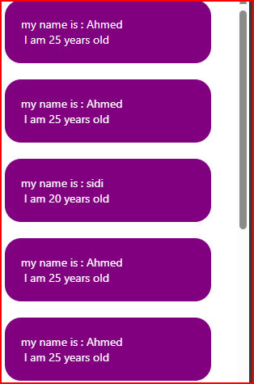

# cour 07 : **`ScrollView`**

## 1. **`ScrollView`**

-   **Description:**

    > `ScrollView` est un composant de React Native qui permet de créer des conteneurs scrollables pour afficher du contenu dépassant les dimensions de l'écran. C'est particulièrement utile lorsque vous avez besoin de présenter une grande quantité de contenu verticalement ou horizontalement.

-   **Syntaxe:**

    ```jsx
    import { ScrollView } from "react-native";

    <ScrollView>{/* Contenu à faire défiler */}</ScrollView>;
    ```

-   **Props Intéressantes du ScrollView:**

    -   **horizontal**: (boolean) Si true, le défilement se fait horizontalement au lieu de verticalement.
    -   **contentContainerStyle**: (object) Styles pour le conteneur de contenu.
    -   **showsVerticalScrollIndicator**: (boolean) Si false, cache l'indicateur de défilement vertical.
    -   **showsHorizontalScrollIndicator**: (boolean) Si false, cache l'indicateur de défilement horizontal.
    -   **onScroll**: (function) Fonction à appeler lorsque le contenu est défilé.
    -   **refreshControl**: (element) Composant pour ajouter une fonctionnalité de "pull to refresh".
    -   **pagingEnabled**: (boolean) Si true, le défilement se fait par pages, utile pour les carrousels.
    -   **scrollEventThrottle**: (number) Détermine la fréquence (en millisecondes) à laquelle l'événement de défilement est émis.

-   **Exemple:**

    ```jsx
    import { StatusBar } from "expo-status-bar";
    import { useState } from "react";
    import { Button, StyleSheet, Text, View, ScrollView } from "react-native";

    export default function App() {
        let infos = [
            {
                id: 1,
                name: "Ahmed",
                age: 25,
            },
            {
                id: 2,
                name: "Ahmed",
                age: 25,
            },
            {
                id: 3,
                name: "sidi",
                age: 20,
            },
            {
                id: 4,
                name: "Ahmed",
                age: 25,
            },
            {
                id: 5,
                name: "Ahmed",
                age: 25,
            },
            {
                id: 6,
                name: "Ahmed",
                age: 25,
            },
            {
                id: 7,
                name: "Ahmed",
                age: 25,
            },
            {
                id: 8,
                name: "Ahmed",
                age: 25,
            },
            {
                id: 9,
                name: "Ahmed",
                age: 25,
            },
        ];

        const infoList = infos.map((ele) => {
            return (
                <View style={styles.info} key={ele.id}>
                    <Text style={{ color: "white" }}>
                        my name is : {ele.name}
                    </Text>
                    <Text style={{ color: "white" }}>
                        {" "}
                        I am {ele.age} years old
                    </Text>
                </View>
            );
        });

        return (
            <ScrollView>
                <View style={styles.container}>
                    {/* <Text>Hello World</Text> */}
                    {infoList}
                </View>
            </ScrollView>
        );
    }

    const styles = StyleSheet.create({
        container: {
            // flex: 1,
            marginTop: 10,
            justifyContent: "center",
            alignItems: "center",
        },
        info: {
            width: "80%",
            padding: 20,
            borderRadius: 20,
            backgroundColor: "purple",
            marginBottom: 20,
        },
    });
    ```

    

## 2. **Le composant `RefreshControl` :**

-   **Description:**

    > Le composant `RefreshControl` en React Native est utilisé pour ajouter une fonctionnalité de rafraîchissement par glissement vers le bas à une vue défilante telle qu'une `ScrollView`, `FlatList` ou `SectionList`. Cela est particulièrement utile pour actualiser les données affichées à l'utilisateur, comme recharger une liste d'articles, de messages, etc.

-   **Syntaxe:**

    Voici la syntaxe de base pour utiliser `RefreshControl` avec une `ScrollView` :

    ```jsx
    <ScrollView
        contentContainerStyle={styles.scrollView}
        refreshControl={
            <RefreshControl refreshing={refreshing} onRefresh={onRefresh} />
        }
    >
        {List}
    </ScrollView>
    ```

-   **Props:**

    -   `refreshing`: Booléen indiquant si le spinner de rafraîchissement doit être affiché.
    -   `onRefresh`: Fonction à appeler lorsque l'utilisateur déclenche une action de rafraîchissement.
    -   `colors`: Tableau de couleurs à utiliser pour le spinner (Android uniquement).
    -   `tintColor`: Couleur du spinner de rafraîchissement (iOS uniquement).
    -   `title`: Texte à afficher pendant le rafraîchissement (iOS uniquement).
    -   `titleColor`: Couleur du texte à afficher pendant le rafraîchissement (iOS uniquement).

-   **Exemple:**

    ```jsx
    import React, { useState } from "react";
    import {
        ScrollView,
        RefreshControl,
        Text,
        StyleSheet,
        View,
    } from "react-native";

    const RefreshableScrollView = () => {
        const [refreshing, setRefreshing] = useState(false);

        const onRefresh = () => {
            setRefreshing(true);
            // Simuler une requête de données
            setTimeout(() => {
                setRefreshing(false);
            }, 2000);
        };

        return (
            <ScrollView
                contentContainerStyle={styles.scrollView}
                refreshControl={
                    <RefreshControl
                        refreshing={refreshing}
                        onRefresh={onRefresh}
                        colors={["#9Bd35A", "#689F38"]} // Couleurs du spinner sur Android
                        progressBackgroundColor="#ffffff" // Couleur de fond du spinner sur Android
                    />
                }
            >
                <View style={styles.item}>
                    <Text>Item 1</Text>
                </View>
                <View style={styles.item}>
                    <Text>Item 2</Text>
                </View>
                <View style={styles.item}>
                    <Text>Item 3</Text>
                </View>
                <View style={styles.item}>
                    <Text>Item 4</Text>
                </View>
                <View style={styles.item}>
                    <Text>Item 5</Text>
                </View>
            </ScrollView>
        );
    };

    const styles = StyleSheet.create({
        scrollView: {
            flexGrow: 1,
            justifyContent: "center",
            alignItems: "center",
            padding: 20,
        },
        item: {
            backgroundColor: "#f9c2ff",
            padding: 20,
            marginVertical: 8,
            width: "100%",
            alignItems: "center",
        },
    });

    export default RefreshableScrollView;
    ```
