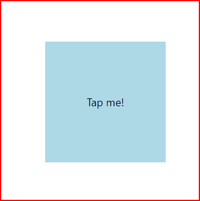

# cour 11 :

## 1. **Composant `TouchableWithoutFeedback` :**

-   **Description:**

    > Le composant `TouchableWithoutFeedback` est utilisé pour capturer les interactions tactiles sans fournir de retour visuel à l'utilisateur. Contrairement à d'autres composants tactiles comme `TouchableOpacity` ou `TouchableHighlight`, il n'affiche aucun changement visuel lorsqu'il est pressé. Il est souvent utilisé lorsque vous avez besoin de détecter des interactions tactiles sans modifier l'apparence de l'élément.

-   **Syntaxe:**

    ```jsx
    import React from "react";
    import { TouchableWithoutFeedback, View, Text } from "react-native";

    const App = () => {
        const handlePress = () => {
            console.log("Element pressed");
        };

        return (
            <TouchableWithoutFeedback onPress={handlePress}>
                <View>
                    <Text>Tap me!</Text>
                </View>
            </TouchableWithoutFeedback>
        );
    };

    export default App;
    ```

-   **Exemple:**

    ```jsx
    import React from "react";
    import {
        TouchableWithoutFeedback,
        View,
        Text,
        StyleSheet,
        Alert,
    } from "react-native";

    const App = () => {
        const handlePress = () => {
            Alert.alert("Element pressed");
        };

        return (
            <View style={styles.container}>
                <TouchableWithoutFeedback onPress={handlePress}>
                    <View style={styles.box}>
                        <Text style={styles.text}>Tap me!</Text>
                    </View>
                </TouchableWithoutFeedback>
            </View>
        );
    };

    const styles = StyleSheet.create({
        container: {
            flex: 1,
            justifyContent: "center",
            alignItems: "center",
        },
        box: {
            width: 200,
            height: 200,
            justifyContent: "center",
            alignItems: "center",
            backgroundColor: "lightblue",
        },
        text: {
            fontSize: 18,
        },
    });

    export default App;
    ```

    

## 2. **Composant `TouchableHighlight`:**

-   **Description:**

    > Le composant `TouchableHighlight` est utilisé pour envelopper une vue ou tout autre composant afin de rendre celui-ci réactif aux interactions tactiles. Lorsqu'il est pressé, `TouchableHighlight` applique un effet visuel en fonçant la couleur de fond de l'élément, ce qui donne à l'utilisateur un retour visuel clair de l'interaction. C'est particulièrement utile pour les boutons ou autres éléments interactifs dans une application.

-   **Syntaxe:**

    ```jsx
    import React from "react";
    import { TouchableHighlight, View, Text, StyleSheet } from "react-native";

    const App = () => {
        const handlePress = () => {
            console.log("Element pressed");
        };

        return (
            <TouchableHighlight onPress={handlePress}>
                <View>
                    <Text>Tap me!</Text>
                </View>
            </TouchableHighlight>
        );
    };

    export default App;
    ```

-   **Exemple:**

    ```jsx
    import React from "react";
    import {
        TouchableHighlight,
        View,
        Text,
        StyleSheet,
        Alert,
    } from "react-native";

    const App = () => {
        const handlePress = () => {
            Alert.alert("Element pressed");
        };

        return (
            <View style={styles.container}>
                <TouchableHighlight
                    onPress={handlePress}
                    underlayColor="darkblue"
                    style={styles.touchable}
                >
                    <View style={styles.box}>
                        <Text style={styles.text}>Tap me!</Text>
                    </View>
                </TouchableHighlight>
            </View>
        );
    };

    const styles = StyleSheet.create({
        container: {
            flex: 1,
            justifyContent: "center",
            alignItems: "center",
        },
        touchable: {
            borderRadius: 10,
        },
        box: {
            width: 200,
            height: 200,
            justifyContent: "center",
            alignItems: "center",
            backgroundColor: "lightblue",
            borderRadius: 10,
        },
        text: {
            fontSize: 18,
        },
    });

    export default App;
    ```

## 3. **Composant `TouchableOpacity`:**

-   **Description:**

    > Le composant `TouchableOpacity` est utilisé pour rendre les éléments interactifs dans une application React Native. Lorsqu'il est pressé, il réduit l'opacité de l'élément, ce qui donne un retour visuel à l'utilisateur. C'est un choix populaire pour créer des boutons et autres éléments interactifs en raison de son effet visuel léger et élégant.

-   **Syntaxe:**

    ```jsx
    import React from "react";
    import { TouchableOpacity, View, Text, StyleSheet } from "react-native";

    const App = () => {
        const handlePress = () => {
            console.log("Element pressed");
        };

        return (
            <TouchableOpacity onPress={handlePress}>
                <View>
                    <Text>Tap me!</Text>
                </View>
            </TouchableOpacity>
        );
    };

    export default App;
    ```

-   **Exemple:**

    ```jsx
    import React from "react";
    import {
        TouchableOpacity,
        View,
        Text,
        StyleSheet,
        Alert,
    } from "react-native";

    const App = () => {
        const handlePress = () => {
            Alert.alert("Element pressed");
        };

        return (
            <View style={styles.container}>
                <TouchableOpacity
                    onPress={handlePress}
                    style={styles.touchable}
                >
                    <View style={styles.box}>
                        <Text style={styles.text}>Tap me!</Text>
                    </View>
                </TouchableOpacity>
            </View>
        );
    };

    const styles = StyleSheet.create({
        container: {
            flex: 1,
            justifyContent: "center",
            alignItems: "center",
        },
        touchable: {
            borderRadius: 10,
        },
        box: {
            width: 200,
            height: 200,
            justifyContent: "center",
            alignItems: "center",
            backgroundColor: "lightblue",
            borderRadius: 10,
        },
        text: {
            fontSize: 18,
        },
    });

    export default App;
    ```
