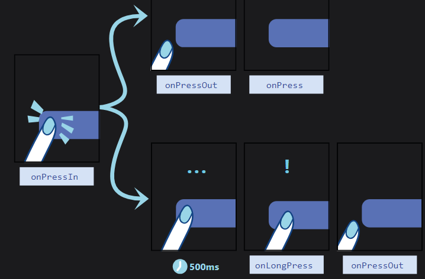

# cour 10 :**La composante `Pressable`**

-   **Description:**

    > La composante `Pressable` en React Native est utilisée pour détecter les interactions utilisateur telles que les pressions, les maintiens et les relâchements. `Pressable` est un composant polyvalent et léger, introduit pour remplacer des composants comme `TouchableOpacity`, `TouchableHighlight`, etc., avec plus de flexibilité.

    -   `Pressable` permet de définir des styles et des comportements spécifiques en fonction de l'état d'interaction (pressé, maintenu, etc.). C'est un composant de base qui peut être utilisé pour construire des boutons, des liens ou tout autre composant interactif.

-   **Syntaxe:**

    ```javascript
    import { Pressable } from "react-native";

    <Pressable
        onPress={() => {
            // Action à effectuer lorsque l'utilisateur appuie sur le composant
        }}
        style={({ pressed }) => [
            {
                backgroundColor: pressed ? "rgb(210, 230, 255)" : "white",
            },
            styles.wrapperCustom,
        ]}
    >
        <Text style={styles.text}>Press Me</Text>
    </Pressable>;
    ```

-   **Propriétés principales:**

    -   `onPress`: Callback exécuté lorsqu'une pression est détectée.
    -   `onPressIn`: Callback exécuté lorsque la pression commence.
    -   `onPressOut`: Callback exécuté lorsque la pression se termine.
    -   `onLongPress`: Callback exécuté lorsqu'une longue pression est détectée.
    -   `style`: Permet de définir les styles en fonction de l'état d'interaction.

    

-   **Exemple:**

    ```javascript
    import { StyleSheet, Text, View, FlatList, Pressable } from "react-native";

    export default function Products({ prod }) {
        function renderItem({ item }) {
            return (
                <Pressable
                    style={({ pressed }) => {
                        return [
                            {
                                backgroundColor: pressed ? "yellow" : "white",
                            },
                        ];
                    }}
                    onPress={() => {
                        console.log("Press without feed back");
                    }}
                    onLongPress={() => {
                        console.log("Long Press");
                    }}
                    onPressIn={() => console.log("Debut Press")}
                    onPressOut={() => console.log("Press Out")}
                >
                    <View style={styles.prod}>
                        <Text style={{ color: "white" }}>{item.name}</Text>
                    </View>
                </Pressable>
            );
        }
        return (
            <View style={styles.container}>
                <FlatList
                    data={prod}
                    renderItem={renderItem}
                    showsVerticalScrollIndicator={false}
                />
            </View>
        );
    }

    const styles = StyleSheet.create({
        container: {
            width: "100%",
        },
        prod: {
            padding: 20,
            marginBottom: 30,
            backgroundColor: "#ff7f50",
            borderRadius: 20,
            flexGrow: 1,
        },
    });
    ```
