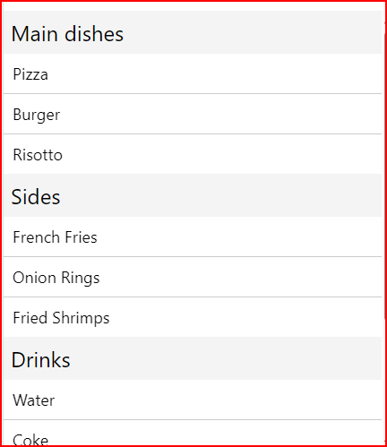

# cour 14 : **SectionList**

-   **Description:**

    > Le composant `SectionList` en React Native est utilisé pour afficher une liste de données groupées en sections. Chaque section peut avoir un en-tête et une liste d'éléments. C'est idéal pour les listes de contacts, les calendriers d'événements, ou toute autre liste où les données sont logiquement regroupées.

    -   `SectionList` est similaire à `FlatList`, mais il est conçu pour afficher des données segmentées en sections. Chaque section a un en-tête et un ensemble d'éléments. Vous pouvez définir le rendu des en-têtes de section et des éléments de liste individuellement.

-   **Syntaxe:**

    ```jsx
    <SectionList
        sections={DATA}
        keyExtractor={(item) => item.id}
        renderItem={({ item }) => ()}
        renderSectionHeader={({ section }) => ( ) }
    />
    ```

-   **Props:**

    -   `sections`: Tableau d'objets représentant les sections de la liste. Chaque objet doit avoir une clé `title` et une clé `data`.

    -   `renderItem`: Fonction pour rendre chaque élément de la liste.

    -   `renderSectionHeader`: Fonction pour rendre l'en-tête de chaque section.

    -   `keyExtractor`: Fonction pour extraire une clé unique pour chaque élément de la liste.

    -   `ItemSeparatorComponent`: Composant pour rendre un séparateur entre les éléments.

    -   `ListHeaderComponent`: Composant pour rendre un en-tête au-dessus de la liste.

    -   `ListFooterComponent`: Composant pour rendre un pied de page sous la liste.

    -   `stickySectionHeadersEnabled`: Booléen pour activer les en-têtes de section collants lors du défilement.

-   **Exemple:**

    ```jsx
    import React from "react";
    import { SectionList, Text, View, StyleSheet } from "react-native";

    const DATA = [
        {
            title: "Main dishes",
            data: ["Pizza", "Burger", "Risotto"],
        },
        {
            title: "Sides",
            data: ["French Fries", "Onion Rings", "Fried Shrimps"],
        },
        {
            title: "Drinks",
            data: ["Water", "Coke", "Beer"],
        },
        {
            title: "Desserts",
            data: ["Cheese Cake", "Ice Cream"],
        },
    ];

    const SectionListExample = () => {
        return (
            <View style={styles.container}>
                <SectionList
                    sections={DATA}
                    keyExtractor={(item, index) => item + index}
                    renderItem={({ item }) => (
                        <Text style={styles.item}>{item}</Text>
                    )}
                    renderSectionHeader={({ section: { title } }) => (
                        <Text style={styles.header}>{title}</Text>
                    )}
                    ItemSeparatorComponent={() => (
                        <View style={styles.separator} />
                    )}
                />
            </View>
        );
    };

    const styles = StyleSheet.create({
        container: {
            flex: 1,
            marginTop: 20,
        },
        header: {
            fontSize: 24,
            backgroundColor: "#f4f4f4",
            padding: 8,
        },
        item: {
            padding: 10,
            fontSize: 18,
            height: 44,
        },
        separator: {
            height: 1,
            width: "100%",
            backgroundColor: "#ccc",
        },
    });

    export default SectionListExample;
    ```

    
