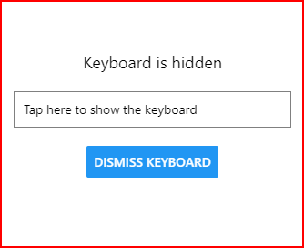

# cour 15 : **Keyboard**

-   **Description:**

    > le module `Keyboard` fournit plusieurs méthodes et événements pour interagir avec le clavier du dispositif. Vous pouvez utiliser ce module pour contrôler le comportement du clavier, écouter ses événements, et gérer les éléments de l'interface utilisateur en fonction de son état (affiché ou masqué).

    -   Le module `Keyboard` est utile pour gérer les interactions avec le clavier, telles que :

        -   Cacher le clavier lorsqu'il n'est plus nécessaire.
        -   Écouter les événements de clavier (affichage, masquage, changement de cadre).
        -   Ajuster la mise en page de l'interface utilisateur en fonction de l'état du clavier.

-   **Syntaxe:**

    Vous pouvez importer et utiliser le module `Keyboard` de React Native de la manière suivante :

    ```jsx
    import { Keyboard } from "react-native";

    Keyboard.method();
    ```

-   **Méthodes et événements :**

    -   `Keyboard.dismiss()`: Masque le clavier.
    -   `Keyboard.addListener(event, callback)`: Ajoute un écouteur pour un événement de clavier.
    -   `Keyboard.removeListener(event, callback)`: Supprime un écouteur d'événement de clavier.

-   **Les événements de clavier :**

    -   `keyboardDidShow`: Appelé lorsque le clavier est affiché.
    -   `keyboardDidHide`: Appelé lorsque le clavier est masqué.
    -   `keyboardWillShow`: Appelé juste avant que le clavier soit affiché.
    -   `keyboardWillHide`: Appelé juste avant que le clavier soit masqué.

-   **Exemple:**

    ```jsx
    import React, { useEffect, useState } from "react";
    import {
        View,
        TextInput,
        Button,
        Keyboard,
        Text,
        StyleSheet,
    } from "react-native";

    const KeyboardExample = () => {
        const [keyboardStatus, setKeyboardStatus] =
            useState("Keyboard is hidden");

        useEffect(() => {
            const showSubscription = Keyboard.addListener(
                "keyboardDidShow",
                () => {
                    setKeyboardStatus("Keyboard is shown");
                }
            );
            const hideSubscription = Keyboard.addListener(
                "keyboardDidHide",
                () => {
                    setKeyboardStatus("Keyboard is hidden");
                }
            );

            // Nettoyer les abonnements à l'événement lorsque le composant est démonté
            return () => {
                showSubscription.remove();
                hideSubscription.remove();
            };
        }, []);

        return (
            <View style={styles.container}>
                <Text style={styles.text}>{keyboardStatus}</Text>
                <TextInput
                    style={styles.input}
                    placeholder="Tap here to show the keyboard"
                />
                <Button
                    title="Dismiss Keyboard"
                    onPress={() => Keyboard.dismiss()}
                />
            </View>
        );
    };

    const styles = StyleSheet.create({
        container: {
            flex: 1,
            justifyContent: "center",
            alignItems: "center",
            padding: 16,
        },
        input: {
            height: 40,
            borderColor: "gray",
            borderWidth: 1,
            padding: 10,
            width: "80%",
            marginBottom: 20,
        },
        text: {
            fontSize: 18,
            marginBottom: 20,
        },
    });

    export default KeyboardExample;
    ```

    
