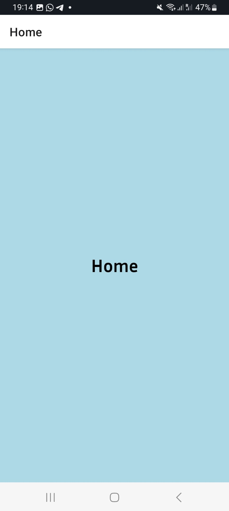

# cour 02 : **Stack Navigation:`Native Stack`**

## 1. **Introduction:**

-   **Introduction:**

    > La **Stack Navigation** est un type de navigation couramment utilisé dans les applications mobiles, permettant de gérer une pile d'écrans où l'utilisateur peut naviguer en avant et en arrière. Chaque nouvel écran est empilé sur le précédent, et l'utilisateur peut revenir à l'écran précédent en "dépilant" les écrans un par un.

    -   Dans React Navigation, la Stack Navigation est implémentée à l'aide de `createStackNavigator` ou `createNativeStackNavigator`.

-   **Installation :**

    ```bash
    npm install @react-navigation/native-stack
    ```

-   **Configuration de la Navigation:** dans le fichier `App.js` :

    ```javascript
    import { NavigationContainer } from "@react-navigation/native";
    import { createStackNavigator } from "@react-navigation/stack";
    import Composnate from "./screens/Composnate";

    // creation de la stack Navigation :
    const Stack = createStackNavigator();

    function App() {
        return (
            <NavigationContainer>
                <Stack.Navigator>
                    <Stack.Screen name="nomDeScreen" component={Composnate} />
                    <Stack.Screen name="nom2" component={Composnate2} />
                </Stack.Navigator>
            </NavigationContainer>
        );
    }

    export default App;
    ```

## 2. **`Stack.Navigator` et `Stack.Screen`:**

-   **Description:**

    > **`Stack.Navigator`** et **`Stack.Screen`** sont deux composants clés utilisés pour configurer et gérer la navigation par pile dans une application React Native avec React Navigation.

    -   **`Stack.Navigator`**: Ce composant sert de conteneur principal pour définir la navigation par pile. Il encapsule et organise les différents écrans de l'application en une pile de navigation, permettant de passer de l'un à l'autre avec des transitions fluides.

    -   **`Stack.Screen`**: Ce composant représente chaque écran individuel au sein du `Stack.Navigator`. Il est utilisé pour spécifier les différents écrans qui composent la pile, ainsi que les paramètres et options spécifiques à chaque écran.

-   **Syntaxe:**

    -   **`Stack.Navigator`**:

        ```jsx
        <Stack.Navigator initialRouteName="Home">
            {/* Screens go here */}
        </Stack.Navigator>
        ```

        -   **`initialRouteName`** (optionnel) : Spécifie l'écran initial à afficher lorsque la pile de navigation est montée pour la première fois.

    -   **`Stack.Screen`**:

        ```jsx
        <Stack.Screen
            name="ScreenName"
            component={ScreenComponent}
            options={screenOptions}
        />
        ```

        -   **`name`** (obligatoire) : Le nom de l'écran, utilisé pour naviguer vers cet écran.
        -   **`component`** (obligatoire) : Le composant React représentant l'écran.
        -   **`options`** (optionnel) : Un objet ou une fonction qui retourne des options spécifiques pour l'écran, telles que le titre, les styles de header, etc.

-   **Exemple:**

    ```javascript
    import * as React from "react";
    import { NavigationContainer } from "@react-navigation/native";
    import { createStackNavigator } from "@react-navigation/stack";
    import HomeScreen from "./screens/HomeScreen";
    import DetailsScreen from "./screens/DetailsScreen";

    const Stack = createStackNavigator();

    function App() {
        return (
            <NavigationContainer>
                <Stack.Navigator>
                    <Stack.Screen name="Portfolio" component={Portfolio} />
                    <Stack.Screen name="Home" component={Home} />
                    <Stack.Screen name="Photo" component={Photo} />
                </Stack.Navigator>
            </NavigationContainer>
        );
    }

    export default App;
    ```

    
