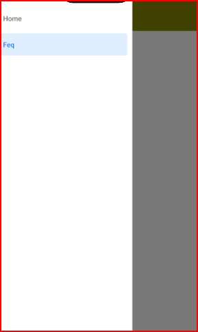
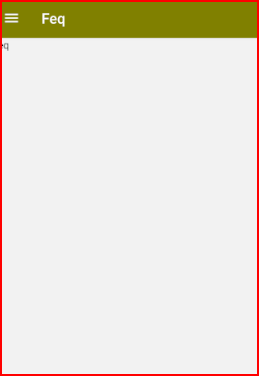

# cour 06 : **Drawer Navigation:**

## 1. **`introduction`:**

-   **Description:**

    > La Drawer Navigation (navigation par tiroir) dans React Navigation est une forme de navigation qui utilise un panneau coulissant latéral. C'est particulièrement utile pour les applications avec une structure de navigation complexe ou plusieurs sections principales. Le panneau de navigation peut être ouvert en glissant depuis le bord de l'écran ou en appuyant sur une icône de menu.

-   **Installation:**

    Pour utiliser la Drawer Navigation dans une application React Native, vous devez installer les bibliothèques nécessaires :

    1.  **React Navigation Core** :

        ```bash
        npm install @react-navigation/native
        ```

    2.  **Dependencies** :
        React Navigation nécessite quelques dépendances supplémentaires.

        ```bash
        npm install react-native-screens react-native-safe-area-context
        ```

    3.  **Drawer Navigator** :
        Installez le paquet pour la navigation par tiroir.

        ```bash
        npm install @react-navigation/drawer
        ```

    4.  **pour expo** :

        ```bash
        npx expo install react-native-gesture-handler react-native-reanimated
        ```

    5.  **config** :

        ```js
        import "react-native-gesture-handler";
        ```

-   **Configuration:**

    Une fois les paquets installés, vous pouvez configurer la navigation par tiroir dans votre application.

    ```javascript
    import * as React from "react";
    import { NavigationContainer } from "@react-navigation/native";
    import { createDrawerNavigator } from "@react-navigation/drawer";
    import HomeScreen from "./screens/HomeScreen";
    import NotificationsScreen from "./screens/NotificationsScreen";

    const Drawer = createDrawerNavigator();

    function MyDrawer() {
        return (
            <Drawer.Navigator initialRouteName="Home">
                <Drawer.Screen name="Home" component={HomeScreen} />
                <Drawer.Screen name="Notif" component={NotificationsScreen} />
            </Drawer.Navigator>
        );
    }

    export default function App() {
        return (
            <NavigationContainer>
                <Stack.Screen
                    name="Drawer"
                    component={MyDrawer}
                    options={{ headerShown: false }}
                />
            </NavigationContainer>
        );
    }
    ```


-   **Exemple:**

    ```js
    // créer le Stack Navigation :
    const Stack = createNativeStackNavigator();
    const Drawer = createDrawerNavigator();

    function MyDrawer() {
        return (
            <Drawer.Navigator
                screenOptions={{
                    headerStyle: {
                        backgroundColor: "olive",
                    },
                    headerTintColor: "white",
                }}
            >
                <Drawer.Screen name="Home" component={Home} />
                <Drawer.Screen name="Feq" component={Feq} />
            </Drawer.Navigator>
        );
    }

    export default function App() {
        return (
            <NavigationContainer>
                <Stack.Navigator>
                    <Stack.Screen
                        name="Drawer"
                        component={MyDrawer}
                        options={{ headerShown: false }}
                    />
                </Stack.Navigator>
            </NavigationContainer>
        );
    }
    ```

    

    

## 2. **Styliser `Drawer`:**

-   **Description:**

> Pour styliser le `Drawer Navigator` dans React Navigation, vous pouvez utiliser plusieurs propriétés et options. Voici une description des principales propriétés de stylisation, leur syntaxe et leur description.

-   **Propriétés:`screenOptions` dans `Drawer.Navigator`**

    -   **drawerStyle**

        -   **Description**: Utilisée pour styliser le tiroir lui-même.
        -   **Syntaxe**:
            ```javascript
            drawerStyle: {
            backgroundColor: 'blue',
            width: 240,
            }
            ```

    -   **drawerType**

        -   **Description**: Détermine le comportement du tiroir.
        -   **Options**: `'front'`, `'back'`, `'slide'`, `'permanent'`
        -   **Syntaxe**:
            ```javascript
            drawerType: "slide";
            ```

    -   **drawerPosition**

        -   **Description**: Détermine si le tiroir se trouve sur le côté gauche ou droit de l'écran.
        -   **Options**: `'left'`, `'right'`
        -   **Syntaxe**:
            ```javascript
            drawerPosition: "left";
            ```

    -   **`drawerActiveTintColor` ,`drawerActiveBackgroundColor`:**

        -   **Description**: Détermine la couleur et le background du screen activé
        -   **Syntaxe**:
            ```javascript
            drawerActiveTintColor: "color",
            drawerActiveBackgroundColor:"color";
            ```

    -   **`drawerInactiveTintColor` ,`drawerInactiveBackgroundColor`:**

        -   **Description**: Détermine la couleur et le background du screen inactivé.
        -   **Syntaxe**:
            ```javascript
            drawerInactiveTintColor: "color",
            drawerInactiveBackgroundColor :"color"
            ```

-   **Propriétés:`options` dans `Drawer.Screen`**

    -   `drawerLabel`

        -   **Description**: Définit le label (texte) affiché pour l'élément du tiroir.
        -   **Syntaxe**:

            ```javascript
            drawerLabel: "title";
            ```

    -   **Propriété `drawerIcon`:**

        -   **Description**: Définit l'icône affichée pour l'élément du tiroir.
        -   **Syntaxe**:
            ```javascript
            drawerIcon: ({color}) => <Icon color={color}>
            ```

-   **methodes:**

    -   **`openDrawer`:**

        -   **Description**: Ouvre le tiroir de navigation.
        -   **Syntaxe**: `navigation.openDrawer()`

    -   `closeDrawer`

        -   **Description**: Ferme le tiroir de navigation.
        -   **Syntaxe**: `navigation.closeDrawer()`

    -   `toggleDrawer`

        -   **Description**: Bascule l'état du tiroir (ouvre s'il est fermé et ferme s'il est ouvert).
        -   **Syntaxe**: `navigation.toggleDrawer()`
