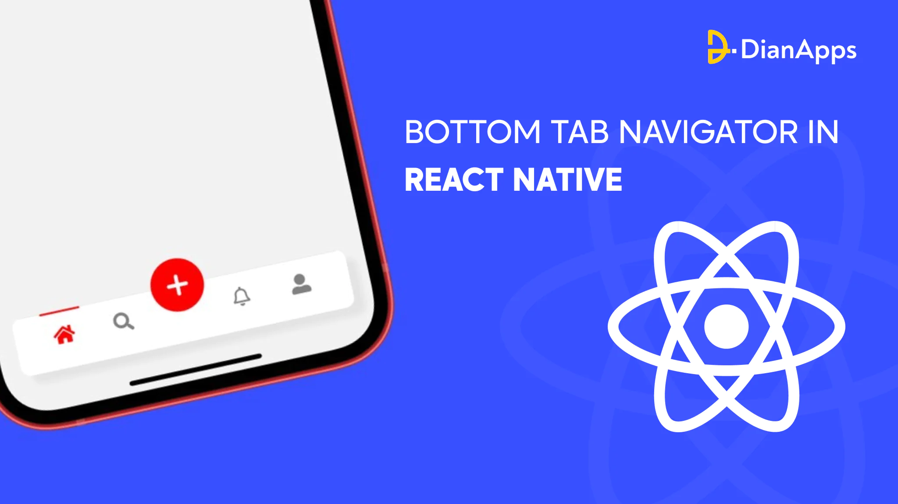
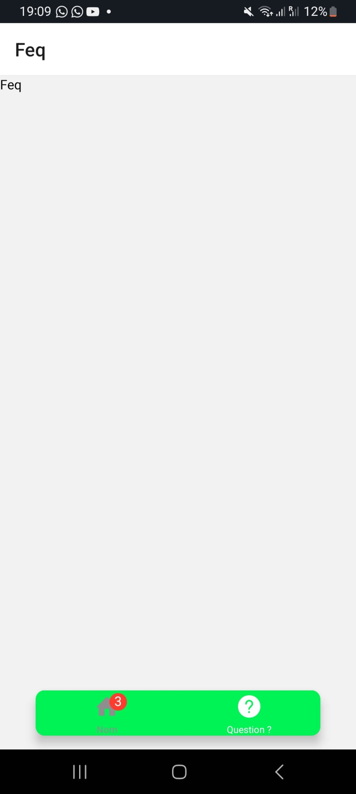

# cour 07 : **Tab Navigation**

## 1. **Introduction:**

-   **Description:**

    > La navigation **Bottom Tab** est un motif de conception courant dans les applications mobiles où un ensemble d'onglets de navigation est fixé en bas de l'écran. Chaque onglet peut mener à différents écrans ou sections de l'application. React Navigation fournit un moyen flexible d'implémenter ce motif dans les applications React Native.

-   **Installation:**

    -   **Installer React Navigation** : Tout d'abord, installez la bibliothèque principale et ses dépendances.

        ```bash
        npm install @react-navigation/native
        ```

    -   **Installer `bottom-tabs`** : Installez le package de navigateur à onglets en bas.

        ```bash
        npm install @react-navigation/bottom-tabs
        ```

    -   **Installer les dépendances** :

        ```bash
        npm install react-native-screens react-native-safe-area-context
        npm install react-native-gesture-handler react-native-reanimated
        ```

-   **Configuration:**

    Une fois que vous avez installé les packages nécessaires, vous pouvez configurer la navigation par onglets en bas. Voici un exemple :

    -   **Créer le Navigateur `bottom-tabs`** : Créez un fichier, par exemple, `MainTabNavigator.js`, pour définir les onglets en bas.

        ```javascript
        import * as React from "react";
        import { createBottomTabNavigator } from "@react-navigation/bottom-tabs";
        import HomeScreen from "./screens/HomeScreen";
        import SettingsScreen from "./screens/SettingsScreen";

        const Tab = createBottomTabNavigator();

        function MainTabNavigator() {
            return (
                <Tab.Navigator>
                    <Tab.Screen name="Home" component={HomeScreen} />
                    <Tab.Screen name="Settings" component={SettingsScreen} />
                </Tab.Navigator>
            );
        }

        export default MainTabNavigator;
        ```

    -   **Utiliser le Navigateur à Onglets en Bas dans l'App** : Mettez à jour votre fichier d'entrée principal pour utiliser le `MainTabNavigator`.

        ```javascript
        import * as React from "react";
        import { NavigationContainer } from "@react-navigation/native";
        import MainTabNavigator from "./MainTabNavigator";

        export default function App() {
            return (
                <NavigationContainer>
                    <MainTabNavigator />
                </NavigationContainer>
            );
        }
        ```



## 2. **styliser le `bottom-tabs`:**

-   **Description:**

    > Pour styliser le `Bottom Tab Navigator` dans React Navigation, vous pouvez utiliser plusieurs propriétés et options. Voici une description des principales propriétés de stylisation, leur syntaxe et leur description.

-   **Propriétés : `screenOptions` dans `Tab.Navigator`:**

    -   **tabBarStyle**

        -   **Description**: Utilisée pour styliser la barre d'onglets elle-même.
        -   **Syntaxe**:
            ```javascript
            tabBarStyle: {
            backgroundColor: 'blue',
            height: 60,
            }
            ```

    -   **tabBarActiveTintColor, tabBarInactiveTintColor**

        -   **Description**: Déterminent la couleur du texte et des icônes des onglets actifs et inactifs.
        -   **Syntaxe**:
            ```javascript
            tabBarActiveTintColor: 'tomato',
            tabBarInactiveTintColor: 'gray',
            ```

    -   **tabBarActiveBackgroundColor, tabBarInactiveBackgroundColor**

        -   **Description**: Déterminent la couleur d'arrière-plan des onglets actifs et inactifs.
        -   **Syntaxe**:
            ```javascript
            tabBarActiveBackgroundColor: 'lightgray',
            tabBarInactiveBackgroundColor: 'white',
            ```

-   **Propriétés : `options` dans `Tab.Screen`:**

    -   **tabBarLabel**

        -   **Description**: Définit le label (texte) affiché pour l'onglet.
        -   **Syntaxe**:
            ```javascript
            tabBarLabel: "Home";
            ```

    -   **tabBarIcon**

        -   **Description**: Définit l'icône affichée pour l'onglet.
        -   **Syntaxe**:
            ```javascript
            tabBarIcon: ({ focused, color, size }) => (
                <Ionicons name="home" color={color} size={size} />
            );
            ```

    -   **tabBarBadge**
        -   **Description**: Définit un badge sur l'onglet.
        -   **Syntaxe**:
            ```javascript
            tabBarBadge: 3;
            ```

## 3. **Exemple Complet:**

```javascript
import { createBottomTabNavigator } from "@react-navigation/bottom-tabs";

const TabBottom = createBottomTabNavigator();
import Home from "./Home";
import Feq from "./Feq";
import { Entypo } from "@expo/vector-icons";
import { AntDesign } from "@expo/vector-icons";

const Tab = () => {
    return (
        <TabBottom.Navigator
            screenOptions={{
                tabBarStyle: {
                    width: "80%",
                    marginHorizontal: "auto",
                    backgroundColor: "#00f354",
                    borderRadius: 10,
                    position: "relative",
                    bottom: 15,
                },
                tabBarActiveTintColor: "white",
            }}
        >
            <TabBottom.Screen
                name="Home"
                component={Home}
                options={{
                    tabBarLabel: "Nom",
                    tabBarIcon: ({ focused, color, size }) => {
                        console.log(focused);
                        console.log("Size :", size);
                        return <Entypo name="home" size={size} color={color} />;
                    },
                    tabBarBadge: 3,
                }}
            />
            <TabBottom.Screen
                name="Feq"
                component={Feq}
                options={{
                    tabBarLabel: "Question ?",
                    tabBarIcon: ({ color }) => (
                        <AntDesign
                            name="questioncircle"
                            size={24}
                            color={color}
                        />
                    ),
                }}
            />
        </TabBottom.Navigator>
    );
};

export default Tab;
```


