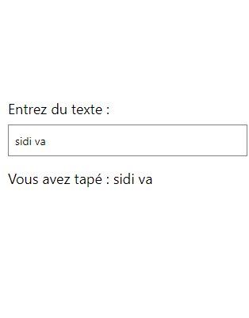

# cour 06 : **`TextInput`**

## 1. **`TextInput`:**

-   **Description:**

    > Le composant `TextInput` dans React Native est utilisé pour créer des champs de saisie de texte. Il permet aux utilisateurs de saisir du texte, comme dans les champs de formulaire. `TextInput` est très flexible et offre de nombreuses propriétés pour personnaliser son comportement et son apparence.

-   **Syntaxe:**

    Pour utiliser le composant `TextInput`, vous devez l'importer depuis `react-native`. Voici la syntaxe de base :

    ```jsx
    import { TextInput } from 'react-native';

    <TextInput
    onChangeText={(text) => { /* action à exécuter */ }}
    value={/* valeur du texte */}
    />
    ```

-   **Props Intéressantes du TextInput:**

    -   **value**: (string) La valeur actuelle du champ de saisie.
    -   **onChangeText**: (function) Fonction à appeler lorsque le texte change.
    -   **placeholder**: (string) Texte à afficher lorsque le champ est vide.
    -   **keyboardType**: (enum) Type de clavier à afficher (e.g., 'default', 'numeric', 'email-address', 'phone-pad').
    -   **secureTextEntry**: (boolean) Si true, masque le texte (utile pour les mots de passe).
    -   **maxLength**: (number) Nombre maximum de caractères autorisés.
    -   **editable**: (boolean) Si false, rend le champ non modifiable.
    -   **style**: (object) Styles personnalisés pour le champ de saisie.
    -   **multiline**: (boolean) Si true, permet plusieurs lignes de texte.
    -   **numberOfLines**: (number) Nombre de lignes visibles lorsque `multiline` est true.

-   **Exemple:**

    ```jsx
    import React, { useState } from "react";
    import { View, TextInput, Text, StyleSheet } from "react-native";

    const App = () => {
        const [text, setText] = useState("");

        return (
            <View style={styles.container}>
                <Text style={styles.label}>Entrez du texte :</Text>
                <TextInput
                    style={styles.input}
                    onChangeText={setText}
                    value={text}
                    placeholder="Tapez ici..."
                    keyboardType="default"
                />
                <Text style={styles.output}>Vous avez tapé : {text}</Text>
            </View>
        );
    };

    const styles = StyleSheet.create({
        container: {
            flex: 1,
            justifyContent: "center",
            padding: 16,
        },
        label: {
            fontSize: 18,
            marginBottom: 8,
        },
        input: {
            height: 40,
            borderColor: "gray",
            borderWidth: 1,
            paddingHorizontal: 8,
            marginBottom: 16,
        },
        output: {
            fontSize: 18,
        },
    });

    export default App;
    ```

    

## 2. **Les Événements du Composant TextInput en React Native:**

### 2.1. `onChangeText`

-   **Description:** Cet événement est déclenché chaque fois que le texte dans le champ de saisie change.

-   **Syntaxe:**

    ```jsx
    <TextInput
        onChangeText={(text) => {
            /* action à exécuter */
        }}
    />
    ```

-   **Exemple:**

    ```jsx
    <TextInput
        onChangeText={(text) => setText(text)}
        value={text}
        placeholder="Tapez ici..."
    />
    ```

### 2.2. `onFocus`

-   **Description:**

    > Cet événement est déclenché lorsque le champ de saisie reçoit le focus, c'est-à-dire lorsque l'utilisateur clique ou touche le champ.

-   **Syntaxe:**

    ```jsx
    <TextInput
        onFocus={() => {
            /* action à exécuter */
        }}
    />
    ```

-   **Exemple:**

    ```jsx
    <TextInput
        onFocus={() => console.log("Focus reçu")}
        placeholder="Tapez ici..."
    />
    ```

### 2.3. `onSubmitEditing`

-   **Description:**

    > Cet événement est déclenché lorsque l'utilisateur soumet l'édition du texte. Cela se produit généralement lorsque l'utilisateur appuie sur la touche "Entrée" sur le clavier.

-   **Syntaxe:**

    ```jsx
    <TextInput
        onSubmitEditing={(event) => {
            /* action à exécuter */
        }}
    />
    ```

-   **Exemple:**

    ```jsx
    <TextInput
        onSubmitEditing={(event) =>
            console.log("Texte soumis : ", event.nativeEvent.text)
        }
        placeholder="Tapez ici..."
    />
    ```

### 2.4. `onBlur`

-   **Description:**

    > Cet événement est déclenché lorsque le champ de saisie perd le focus, c'est-à-dire lorsque l'utilisateur clique ou touche en dehors du champ.

-   **Syntaxe:**

    ```jsx
    <TextInput
        onBlur={() => {
            /* action à exécuter */
        }}
    />
    ```

-   **Exemple:**

    ```jsx
    <TextInput
        onBlur={() => console.log("Focus perdu")}
        placeholder="Tapez ici..."
    />
    ```

### 2.5. `onScroll`

-   **Description:**

    > Cet événement est déclenché lorsque le contenu du champ de saisie est défilé. Il est particulièrement utile pour les champs de saisie multiline.

-   **Syntaxe:**

    ```jsx
    <TextInput
        onScroll={(event) => {
            /* action à exécuter */
        }}
    />
    ```

-   **Exemple:**

    ```jsx
    <TextInput
        multiline
        onScroll={(event) =>
            console.log("Défilement : ", event.nativeEvent.contentOffset)
        }
        placeholder="Tapez ici..."
        style={{ height: 100 }}
    />
    ```
