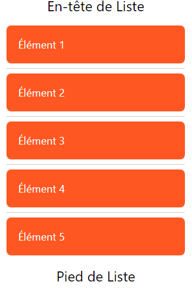

# cour 08 :**`FlatList`**

-   **Description:**

    > `FlatList` est un composant performant pour afficher des listes de données en React Native. Il est optimisé pour les grandes quantités de données en rendant les éléments de la liste à la demande.

    -   `FlatList` offre plusieurs fonctionnalités telles que le défilement infini, les en-têtes et les pieds de liste, et le rafraîchissement.

-   **Syntaxe:**

    ```jsx
    import { FlatList } from 'react-native';

    <FlatList
    data={/* données à afficher */}
    renderItem={/* fonction pour rendre chaque élément */}
    keyExtractor={/* fonction pour extraire les clés uniques */}
    />
    ```

-   **Props Intéressantes du FlatList:**

    -   **data**: (array) La source de données pour la liste.
    -   **renderItem**: (function) Fonction qui rend chaque élément de la liste.
    -   **keyExtractor**: (function) Fonction qui retourne une clé unique pour chaque élément.
    -   **ListHeaderComponent**: (component) Composant à afficher en tant qu'en-tête de la liste.
    -   **ListFooterComponent**: (component) Composant à afficher en tant que pied de la liste.
    -   **ItemSeparatorComponent**: (component) Composant à afficher entre les éléments.
    -   **onEndReached**: (function) Fonction appelée lorsque la fin de la liste est atteinte.

    -   **refreshing**: (boolean) Si true, montre un indicateur de rafraîchissement.
    -   **onRefresh**: (function) Fonction appelée lors du tirage vers le bas pour rafraîchir.

-   **Exemple:**

    ```jsx
    import React, { useState } from "react";
    import { FlatList, View, Text, StyleSheet } from "react-native";

    const App = () => {
        const [data, setData] = useState([
            { id: "1", title: "Élément 1" },
            { id: "2", title: "Élément 2" },
            { id: "3", title: "Élément 3" },
            { id: "4", title: "Élément 4" },
            { id: "5", title: "Élément 5" },
        ]);

        const renderItem = ({ item }) => (
            <View style={styles.item}>
                <Text style={styles.title}>{item.title}</Text>
            </View>
        );

        return (
            <FlatList
                data={data}
                renderItem={renderItem}
                keyExtractor={(item) => item.id}
                ListHeaderComponent={() => (
                    <Text style={styles.header}>En-tête de Liste</Text>
                )}
                ListFooterComponent={() => (
                    <Text style={styles.footer}>Pied de Liste</Text>
                )}
                ItemSeparatorComponent={() => <View style={styles.separator} />}
            />
        );
    };

    const styles = StyleSheet.create({
        item: {
            backgroundColor: "#ff5722",
            padding: 20,
            marginVertical: 8,
            marginHorizontal: 16,
            borderRadius: 8,
        },
        title: {
            color: "white",
            fontSize: 18,
        },
        header: {
            fontSize: 24,
            textAlign: "center",
            marginVertical: 10,
        },
        footer: {
            fontSize: 24,
            textAlign: "center",
            marginVertical: 10,
        },
        separator: {
            height: 1,
            backgroundColor: "#ccc",
            marginHorizontal: 16,
        },
    });

    export default App;
    ```

    
