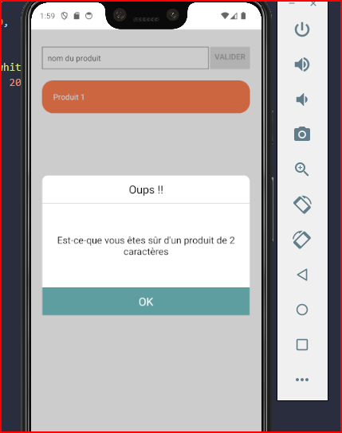

# cour 13 : **Modal**

-   **Description:**

    > Le composant Modal en React est utilisé pour afficher des dialogues ou des fenêtres modales au-dessus du contenu principal de l'application.

    -   Un composant Modal permet d'afficher des informations ou des interactions importantes de manière flottante sur la page courante. Cela peut inclure des messages d'erreur, des formulaires, des confirmations, etc. Les modals sont souvent utilisés pour attirer l'attention de l'utilisateur sans le rediriger vers une nouvelle page.

-   **Syntaxe:**

    ```jsx
    <Modal
        animationType="slide"
        transparent={true}
        visible={modalVisible}
        onRequestClose={() => {
            setModalVisible(!modalVisible);
        }}
    ></Modal>
    ```

-   **Props:**

    -   `animationType`: le type d'animation à utiliser lors de l'affichage et de la fermeture du modal. Les valeurs possibles sont `'none'`, `'slide'`, et `'fade'`.

    -   `transparent`: Booléen qui, s'il est vrai, rend l'arrière-plan du modal transparent.

    -   `visible`: Booléen qui contrôle la visibilité du modal.

    -   `onRequestClose`: Fonction appelée lorsque l'utilisateur demande la fermeture du modal. Ceci est requis sur Android.

    -   `onShow`: Fonction appelée lorsque le modal apparaît.

    -   `onDismiss`: Fonction appelée lorsque le modal est fermé (iOS uniquement).

-   **Exemple:**

    ```jsx
    import { StatusBar } from "expo-status-bar";
    import { useState } from "react";
    import {
        Modal,
        StyleSheet,
        View,
        Text,
        Button,
        Pressable,
    } from "react-native";
    import Products from "./components/Products";
    import AddProducts from "./components/AddProducts";

    let count = 1;
    export default function App() {
        const [prod, setProd] = useState([
            { id: 1, name: "Produit 1", price: 20 },
        ]);
        const [showModal, setShowModal] = useState(false);

        function handelDelete(id) {
            setProd(prod.filter((ele) => (ele.id === id ? false : true)));
        }

        function handelPress(value) {
            if (value.length > 3) {
                count++;
                setProd([...prod, { id: count, name: value, price: 20 }]);
            } else {
                setShowModal(true);
            }
        }

        return (
            <View style={styles.container}>
                <AddProducts handelPress={handelPress} setProd={setProd} />
                <Products prod={prod} handelDelete={handelDelete} />
                <StatusBar style="auto" />
                <Modal
                    visible={showModal}
                    onRequestClose={() => setShowModal(false)}
                    animationType="fade"
                    transparent
                >
                    <View style={styles.containerModal}>
                        <View style={styles.modalContant}>
                            <View style={styles.headerModal}>
                                <Text style={styles.titleModal}>Oups !!</Text>
                            </View>
                            <View style={styles.descModal}>
                                <Text
                                    style={{
                                        fontSize: 17,
                                        textAlign: "center",
                                        fontWeight: "400",
                                    }}
                                >
                                    Est-ce-que vous êtes sûr d'un produit de 2
                                    caractères
                                </Text>
                            </View>
                            <Pressable
                                style={styles.okBtn}
                                onPress={() => setShowModal(false)}
                            >
                                <Text style={styles.txtBtn}>OK</Text>
                            </Pressable>
                        </View>
                    </View>
                </Modal>
            </View>
        );
    }

    const styles = StyleSheet.create({
        container: {
            padding: 20,
            paddingTop: 80,
            backgroundColor: "#fff",
        },
        containerModal: {
            flex: 1,
            backgroundColor: "rgba(0,0,0,0.2)",
            alignItems: "center",
            justifyContent: "center",
        },
        modalContant: {
            backgroundColor: "#fff",
            width: "90%",
            height: 250,
            borderRadius: 10,
            alignItems: "center",
            justifyContent: "flex-start",
        },
        headerModal: {
            // backgroundColor: "gray",
            width: "100%",
            height: 50,
            color: "white",
            alignItems: "center",
            justifyContent: "center",
            // marginBottom: 20,
            borderTopLeftRadius: 10,
            borderTopRightRadius: 10,
            borderBottomWidth: 1,
            borderBottomColor: "lightgray",
        },
        titleModal: {
            // color: "white",
            fontSize: 20,
        },
        descModal: {
            alignItems: "center",
            justifyContent: "center",
            width: "100%",
            height: 150,
        },
        okBtn: {
            backgroundColor: "#5f9ea0",
            width: "100%",
            height: 50,
            alignItems: "center",
            justifyContent: "center",
            position: "absolute",
            bottom: 0,
        },
        txtBtn: {
            color: "white",
            fontSize: 20,
        },
    });
    ```

    
